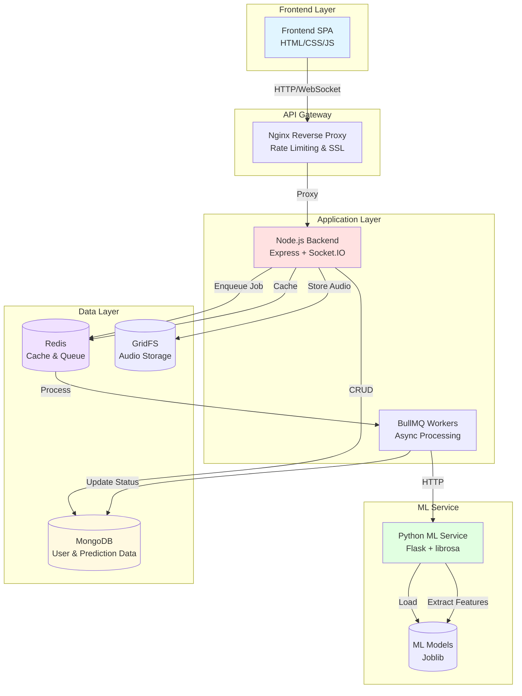
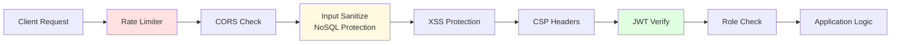
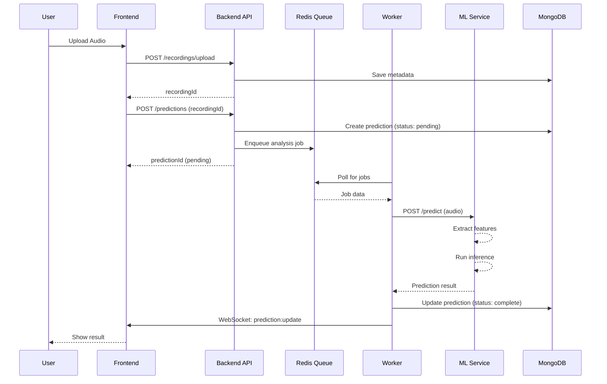

# Voice Health Detection - System Architecture

## Overview

The Voice Health Detection system utilizes a microservices architecture with clear separation of concerns, asynchronous processing, and comprehensive security layers.



## Component Details

### 1. Frontend Layer
- **Tech Stack:** Vanilla JS, HTML5, CSS3
- **Responsibilities:**
  - User interface rendering
  - Form validation (XSS-protected)
  - WebSocket real-time updates
  - Audio recording & upload

### 2. Backend API (Node.js)
- **Tech Stack:** Express.js, Socket.IO, Mongoose
- **Responsibilities:**
  - User authentication (JWT)
  - Request validation & sanitization
  - Rate limiting
  - Job queue management
  - WebSocket server

**Key Modules:**
- `services/`: Business logic layer
  - `authService.js`: Authentication operations
  - `predictionService.js`: Prediction management
  - `mlService.js`: ML communication client
- `middleware/`: Request processing
  - `authMiddleware.js`: JWT & role verification
  - `rateLimiter.js`: Rate limiting configs
  - `securityMiddleware.js`: NoSQL/XSS protection
- `jobs/`: Async workers
  - `audioAnalysisQueue.js`: BullMQ job queue

### 3. ML Service (Python)
- **Tech Stack:** Flask, librosa, scikit-learn, numpy
- **Responsibilities:**
  - Audio feature extraction
  - ML model inference
  - Model training endpoints

**Features:**
- Audio validation (duration, silence, format)
- Feature extraction (MFCCs, chroma, spectral)
- NaN/Inf protection
- Model health checking

### 4. Data Layer

#### MongoDB
- **Collections:**
  - `users`: User accounts & profiles
  - `predictions`: Prediction results & history
  - `recordings`: Audio metadata

**Indexes:**
- Users: `email` (unique), `role`, `createdAt`
- Predictions: `userId+createdAt`, `recordingId`, `status`
- Compound: `userId+condition+createdAt`

#### Redis
- **Use Cases:**
  - Job queue (BullMQ)
  - Session caching
  - Prediction result caching
  - Token blacklist

#### GridFS
- **Purpose:** Large file storage (audio recordings)
- **Features:** Streaming upload/download

## Security Layers



### Security Features
1. **Input Sanitization:** express-mongo-sanitize
2. **Rate Limiting:** Endpoint-specific limits
3. **JWT Authentication:** Access + refresh tokens
4. **WebSocket Auth:** Token-based connection
5. **XSS Protection:** CSP headers + sanitization
6. **Token Blacklist:** Redis-backed revocation

## Data Flow - Prediction



## Scaling Strategy

### Horizontal Scaling
- **Backend:** Multiple instances behind Nginx load balancer
- **Workers:** Scale BullMQ workers independently
- **ML Service:** Load balancer across ML instances

### Vertical Scaling
- **MongoDB:** Increase resources for data growth
- **Redis:** Add memory for larger cache/queue

### Performance Optimization
1. **Caching:** Redis for frequent queries
2. **Database:** Compound indexes, aggregation pipelines
3. **Async Processing:** Job queue for ML tasks
4. **CDN:** Static assets delivery

## Monitoring & Observability

```merm aid
graph TB
    APP[Application] --> SENTRY[Sentry<br/>Error Tracking]
    APP --> LOGS[Application Logs]
    APP --> METRICS[Performance Metrics]
    
    SENTRY --> ALERT[Alert System]
    LOGS --> DASHBOARD[Monitoring Dashboard]
    METRICS --> DASHBOARD

    style SENTRY fill:#ffe1e1
    style DASHBOARD fill:#e1f5ff
```

### Monitoring Stack
- **Error Tracking:** Sentry
- **Request Tracing:** X-Trace-ID headers
- **Health Checks:** `/api/health` endpoints
- **Performance:** Execution time tracking

## Deployment Architecture

### Docker Containers
- `voice-health-backend` (x2 replicas)
- `voice-health-ml`
- `voice-health-db` (MongoDB)
- `voice-health-redis`
- `voice-health-proxy` (Nginx)

### Network
- Internal bridge network
- Only Nginx exposed externally (ports 80/443)

### Volumes
- `mongodb_data`: Persistent database
- `redis_data`: Queue persistence
- `ml_models`: ML model files
- `nginx_logs`: Access logs

## Technology Stack Summary

| Layer | Technology | Version | Purpose |
|-------|-----------|---------|---------|
| **Frontend** | Vanilla JS | ES6+ | UI/UX |
| **Backend** | Node.js + Express | 18+ / 4.x | API Server |
| **ML Service** | Python + Flask | 3.9+ / 2.x | ML Inference |
| **Database** | MongoDB | 6.0 | Data Storage |
| **Cache/Queue** | Redis | 7.x | Caching & Jobs |
| **Proxy** | Nginx | 1.24+ | Load Balancer |
| **Queue** | BullMQ | 4.x | Job Processing |
| **Auth** | JWT | - | Authentication |
| **Monitoring** | Sentry | Latest | Error Tracking |

## Key Design Decisions

1. **Microservices:** Separation allows independent scaling
2. **Async Processing:** Queue prevents blocking on slow ML operations
3. **Service Layer:** Business logic separated from routes
4. **Redis Caching:** Reduces database load for frequent queries
5. **MongoDB Aggregation:** Solves N+1 query problem
6. **Multi-stage Docker:** Minimal production images
7. **Health Checks:** Automated recovery and monitoring
