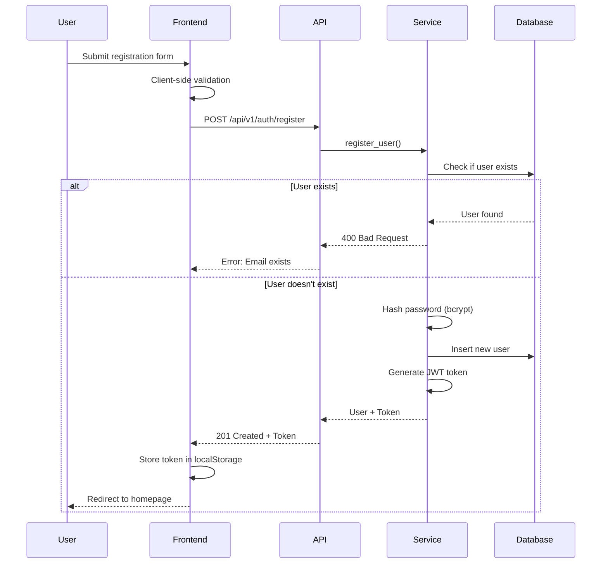
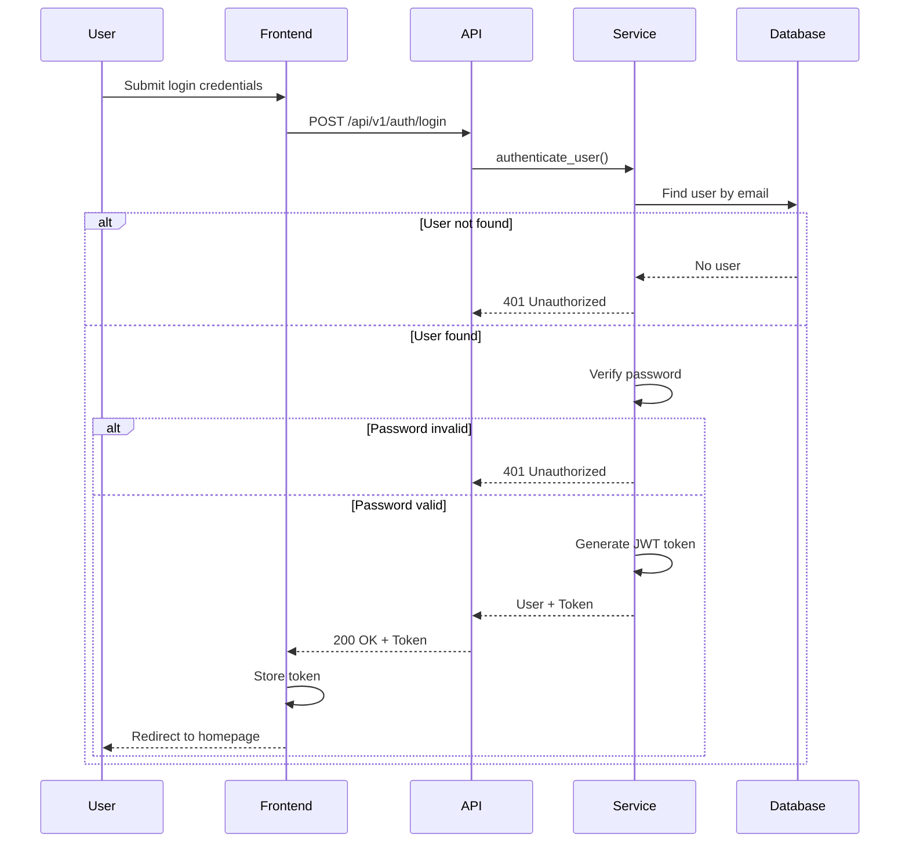
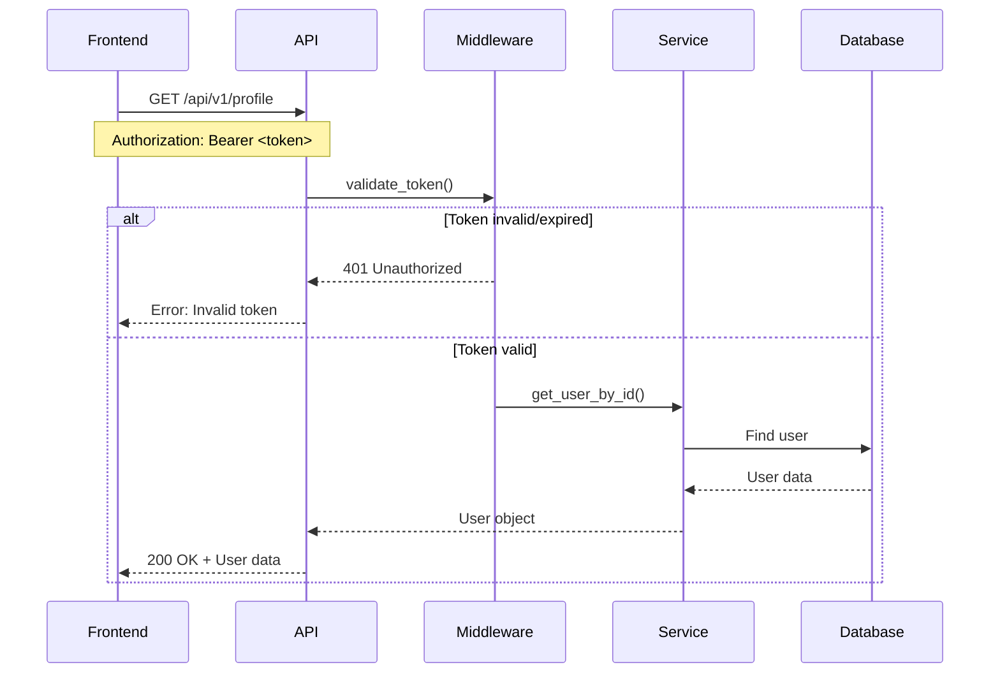

# Architecture Documentation
Voice Health Detection - Person 1: Authentication & User Management

## System Overview

The authentication and user management system is built using a modern, scalable architecture following clean code principles and separation of concerns. The system is designed to be secure, maintainable, and production-ready.

### Technology Stack

**Backend:**
- **Framework:** FastAPI 0.109.0
- **Database:** MongoDB 7.0 (with Motor async driver)
- **Authentication:** JWT (JSON Web Tokens)
- **Password Hashing:** bcrypt
- **Testing:** pytest with async support

**Frontend:**
- **HTML5** - Semantic, accessible markup
- **CSS3** - Modern styling with CSS variables
- **Vanilla JavaScript** - No frameworks, pure JS
- **HTTP Client:** Fetch API

**Deployment:**
- **Containerization:** Docker
- **Orchestration:** Docker Compose
- **Web Server:** Uvicorn (ASGI)

---

## Architecture Patterns

### 1. Layered Architecture

The backend follows a clear layered architecture:

```
┌─────────────────────────────────────┐
│         Controllers Layer           │  ← HTTP Request Handling
├─────────────────────────────────────┤
│          Services Layer             │  ← Business Logic
├─────────────────────────────────────┤
│           Models Layer              │  ← Data Validation
├─────────────────────────────────────┤
│          Database Layer             │  ← Data Persistence
└─────────────────────────────────────┘
```

**Controllers** (`backend/controllers/`):
- Handle HTTP requests and responses
- Input validation
- Call service layer methods
- Return appropriate status codes

**Services** (`backend/services/`):
- Contain business logic
- Database operations
- Password hashing and verification
- Token generation

**Models** (`backend/models/`):
- Pydantic schemas for data validation
- Request/response models
-  Type safety

**Database** (`backend/database/`):
- MongoDB connection management
- Collection access
- Connection lifecycle

### 2. Middleware Pattern

Middleware components handle cross-cutting concerns:

- **Authentication Middleware** - JWT token validation
- **CORS Middleware** - Cross-origin resource sharing
- **Error Handler Middleware** - Centralized error handling

```
Request → CORS → Auth Middleware → Controller → Service → Database
                      ↓
                Error Handler
```

### 3. Repository Pattern

Services interact with the database through a repository-like interface, abstracting data access details.

---

## Component Architecture

### Backend Structure

```
backend/
├── main.py                 # Application entry point
├── config.py               # Configuration management
├── controllers/            # HTTP request handlers
│   ├── auth_controller.py      # Authentication endpoints
│   └── profile_controller.py   # Profile management endpoints
├── services/               # Business logic
│   └── auth_service.py         # Authentication service
├── models/                 # Data models
│   └── user_model.py           # User Pydantic schemas
├── middleware/             # Middleware components
│   ├── auth_middleware.py      # JWT validation
│   ├── error_handler.py        # Error handling
│   └── cors.py                 # CORS configuration
├── utils/                  # Utility functions
│   ├── security.py             # Password & JWT utilities
│   ├── validators.py           # Input validation
│   └── helpers.py              # Helper functions
├── database/               # Database layer
│   └── mongodb.py              # MongoDB connection
└── tests/                  # Test suite
    └── test_auth.py            # Authentication tests
```

### Frontend Structure

```
frontend/
├── css/                    # Stylesheets
│   ├── styles.css              # Main styles
│   └── responsive.css          # Responsive design
├── js/                     # JavaScript modules
│   ├── api.js                  # API communication
│   ├── auth.js                 # Authentication logic
│   └── profile.js              # Profile management
└── views/                  # HTML pages
    ├── homepage.html           # Landing page
    ├── login.html              # Login form
    ├── register.html           # Registration form
    └── profile.html            # User profile
```

---

## Authentication Flow

### Registration Flow



### Login Flow



### Protected Resource Access



---

## Database Schema

### Users Collection

```javascript
{
  "_id": ObjectId,
  "email": String (unique, indexed),
  "hashed_password": String,
  "full_name": String,
  "phone": String (optional),
  "age": Number (optional),
  "gender": String (optional, enum: male|female|other),
  "created_at": DateTime,
  "updated_at": DateTime
}
```

**Indexes:**
- `email`: Unique index for fast lookup and uniqueness constraint
- `created_at`: Index for sorting and filtering by registration date

---

## Security Model

### Password Security

1. **Hashing**: bcrypt with automatic salt generation
2. **Strength Requirements**:
   - Minimum 8 characters
   - At least one uppercase letter
   - At least one lowercase letter
   - At least one digit

### JWT Token Security

1. **Token Structure**:
   ```json
   {
     "user_id": "...",
     "email": "user@example.com",
     "exp": 1234567890
   }
   ```

2. **Token Expiration**: 24 hours (configurable)
3. **Algorithm**: HS256
4. **Secret Key**: Minimum 32 characters, environment-based

### API Security

1. **CORS**: Restricted to configured origins
2. **Headers**: Secure headers configuration
3. **Input Validation**: Pydantic schemas validate all inputs
4. **Error Messages**: Generic messages to prevent information leakage

---

## Scalability Considerations

### Horizontal Scaling

The architecture supports horizontal scaling:

1. **Stateless API**: JWT tokens eliminate server-side sessions
2. **Database**: MongoDB replica sets for read scaling
3. **Load Balancing**: Multiple backend instances via Docker Compose

### Performance Optimizations

1. **Async/Await**: Non-blocking I/O operations
2. **Connection Pooling**: Reuse database connections
3. **Caching**: Consider Redis for token blacklisting (future)
4. **CDN**: Static frontend assets can be served via CDN

---

## Error Handling Strategy

### Error Types

1. **Validation Errors** (422): Invalid input data
2. **Authentication Errors** (401): Invalid/missing token
3. **Authorization Errors** (403): Insufficient permissions
4. **Not Found Errors** (404): Resource doesn't exist
5. **Server Errors** (500): Internal server errors

### Error Response Format

```json
{
  "error": "ErrorType",
  "detail": "Human-readable message"
}
```

For validation errors:
```json
{
  "error": "Validation Error",
  "detail": "Invalid input data",
  "errors": [
    {
      "field": "email",
      "message": "Invalid email format"
    }
  ]
}
```

---

## Testing Strategy

### Test Pyramid

```
      /\
     /  \      E2E Tests (Future)
    /____\
   /      \    Integration Tests
  /________\
 /          \  Unit Tests
/____________\
```

**Current Coverage:**
-  Unit Tests: Authentication endpoints
- ✅ Integration Tests: Full auth flow
- 🔄 E2E Tests: Planned for future

### Test Categories

1. **Registration Tests**
   - Successful registration
   - Duplicate email
   - Invalid email format
   - Weak password
   - Missing fields

2. **Login Tests**
   - Successful login
   - Wrong password
   - Non-existent user

3. **Protected Endpoints**
   - Valid token access
   - Invalid token rejection
   - Missing token rejection

---

## Monitoring & Logging

### Health Checks

- **Endpoint**: `/api/health`
- **Checks**: Database connectivity
- **Docker**: Health check in Dockerfile

### Logging

- **Level**: INFO (configurable)
- **Format**: Structured logging
- **Output**: Console (can be redirected to files)

---

## Future Enhancements

### Planned Features

1. **Email Verification**: Send verification emails on registration
2. **Password Reset**: Forgot password flow
3. **Refresh Tokens**: Longer-lived refresh tokens
4. **Rate Limiting**: Prevent brute force attacks
5. **OAuth Integration**: Google/Facebook login
6. **2FA**: Two-factor authentication
7. **Session Management**: Active sessions view
8. **Audit Logs**: Track user actions

---

## Integration with Person 2

### Integration Points

Person 2 (Prediction Features) can integrate with Person 1's system through:

1. **Authentication Middleware**: Use `get_current_user` dependency
2. **User ID**: Access user_id from authenticated requests
3. **Helpers**: Utility functions in `backend/utils/helpers.py`

### Example Integration

```python
from backend.middleware.auth_middleware import get_current_user
from fastapi import Depends

@router.post("/api/v1/predict")
async def predict(
    audio_file: UploadFile,
    current_user: dict = Depends(get_current_user)
):
    user_id = str(current_user["_id"])
    # Person 2's prediction logic here
    pass
```

---

## Deployment Architecture

### Development

```
Developer → Backend :8000
         → Frontend :3000
         → MongoDB :27017
```

### Production (Docker Compose)

```
Internet → Nginx :80 → Frontend :3000
                    → Backend :8000 → MongoDB :27017
```

### Scaling (Future)

```
Internet → Load Balancer
             ├→ Backend Instance 1
             ├→ Backend Instance 2
             └→ Backend Instance 3
                    ↓
              MongoDB Replica Set
```

---

## Best Practices Implemented

1. ✅ **Separation of Concerns**: Clear layer boundaries
2. ✅ **DRY Principle**: Reusable utilities and helpers
3. ✅ **Type Safety**: Pydantic models for validation
4. ✅ **Security First**: bcrypt + JWT, secure defaults
5. ✅ **Error Handling**: Centralized error management
6. ✅ **Testing**: Comprehensive test coverage
7. ✅ **Documentation**: Code comments and API docs
8. ✅ **Configuration**: Environment-based config
9. ✅ **Scalability**: Stateless, horizontally scalable
10. ✅ **Maintainability**: Clean code, modular structure

---

**Person 1 - Authentication & User Management**  
Voice Health Detection System
